# Shell脚本


## 指定interpreter
在首行加入：
```html
<div class = "alert alert-block alert-success">
\#!/bin/bash
</div>
```


## 使脚本具有执行权限
<div class = "alert alert-block alert-success">
chmod +x ./temp.sh
</div>


## 执行脚本
<div class = "alert alert-block alert-success">
./temp.sh
</div>


## 变量

### 定义变量 & 使用变量
<div class = "alert alert-block alert-success">
read INPUTVALUE

echo "Hello, \${INPUTVALUE}"
</div>

### 重新定义变量
注意：定义变量时，变量名和等号之间不能有空格

注意：readonly后变量改为只读变量
<div class = "alert alert-block alert-success">
INPUTVALUE="simonyun"

readonly INPUTVALUE

INPUTVALUE='oopsi'
</div>

### 删除变量
注意：unset命令不能删除只读变量
<div class = "alert alert-block alert-success">
unset variable_name
</div>

### 变量类型
#### 局部变量
在脚本或命令中定义，仅在当前shell实例中有效

#### 环境变量
所有程序，包括shell启动的程序，都能访问环境变量。shell也可以定义环境变量

#### shell变量
是一种特殊变量。

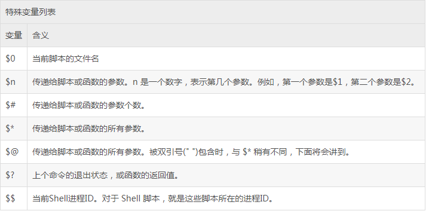


## for loop
```shell
for var in \$*
do
    echo "\$var"
done
```


## Shell替换

### 转义字符
echo后使用的指令
- -e 表示对转义字符进行替换
- -E 表示禁止转义
- -n 表示禁止插入换行符

以下是在echo中使用的转义字符：
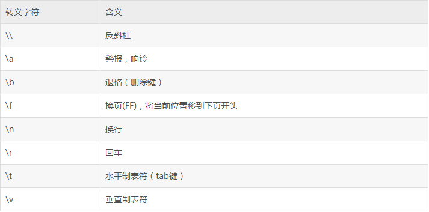

### 命令替换
使用反引号
<div class = "alert alert-block alert-success">
DATE=`date`
</div>

### 变量替换
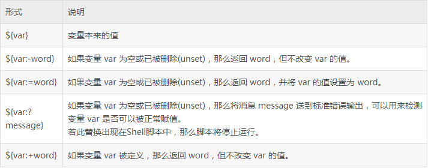

### 数学运算
注意：表达式和运算符之间要有空格

注意：乘号（*）前必须加反斜杠（\）转义
<div class = "alert alert-block alert-success">
val=`expr 2 + 2`
</div>

### logical operator
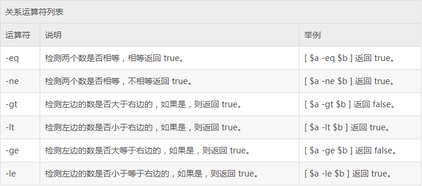

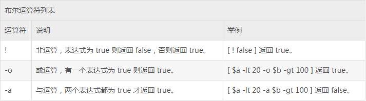

### string operator
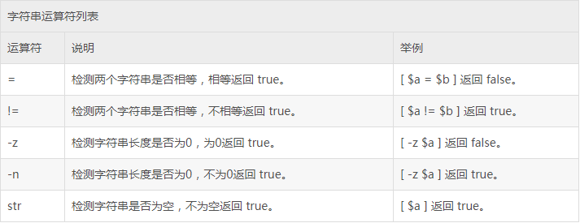

### file properties
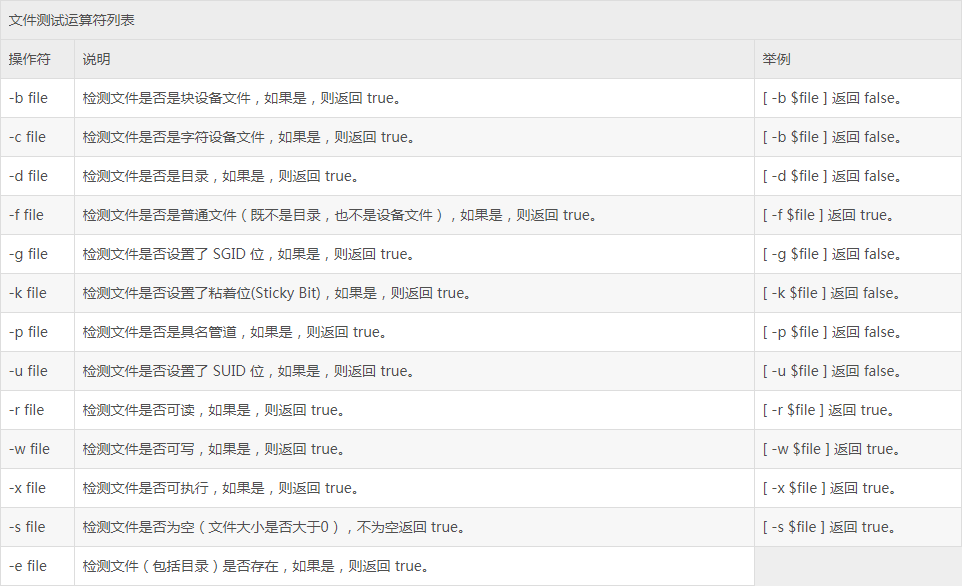


## Comment
#开头的行就是注释。没有多行注释！


## String 字符串

### 单引号
- 单引号里的任何字符都会原样输出，单引号字符串中的变量是无效的
- 单引号字串中不能出现单引号

### 双引号
- 双引号里可以有变量
- 双引号里可以出现转义字符

### 字符串拼接
<div class = "alert alert-block alert-success">
your_name="simonyun"

greeting="hello, "\$your_name" !"

greeting_1="hello, \${your_name} !"
</div>

### 字符串长度
<div class = "alert alert-block alert-success">
echo \${#string}
</div>

### 提取substring
<div class = "alert alert-block alert-success">
echo \${string:1:4}
</div>

### 查找substring
<div class = "alert alert-block alert-success">
echo `expr index "\$string" is`
</div>


## array

### array 定义
<div class = "alert alert-block alert-success">
array_name=(value0 value1 value2 value3)
</div>

注意：elements要用空格分开，也可以换行
注意：也可以单独定义。array_name[0]=value0

### array 提取
<div class = "alert alert-block alert-success">
\${array_name[index]}
</div>
注意：\${array_name[*]} 可以获取所有元素。也可以用@！
    
### array 长度
<div class = "alert alert-block alert-success">
\${#array_name[@]}
</div>


## Shell echo

如果变量与其他字符相连的话，需要使用大括号{}。
<div class = "alert alert-block alert-success">
month=11

echo "\${month}-23-1996"
</div>

使用\c可以取消换行。
<div class = "alert alert-block alert-success">
echo "Hello, \c"
echo "World!"
</div>

将结果定向至文件
<div class = "alert alert-block alert-success">
echo "Hello, simonyun!" > myfile
</div>

注意：如果想原样输出字符串，使用单引号！


## Shell printf
去网站看看！

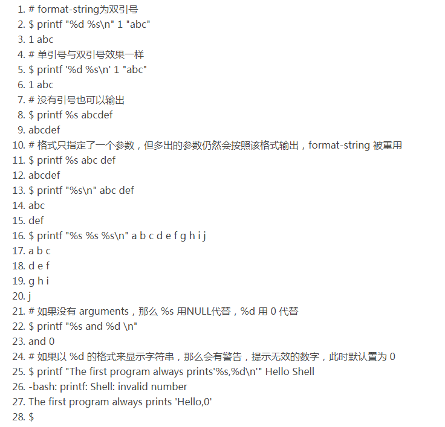


## if-else statement
```shell
if [$a == $b]
then
    echo "a is equal to b"
elif [$a gt $b]
then
    echo "a is greater than b"
else
    echo "a is less than b"
fi
```

## Shell case esac
看网站！类似switch case syntax。

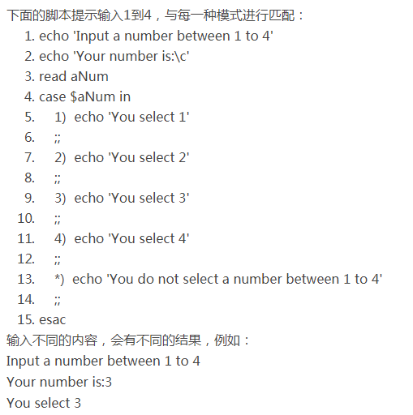


## Shell while-loop & until & for-loop & comtinue/break
略！下次看到时希望你还记得hh


## Shell function
函数的定义格式：
```shell
function_name () {
   list of commands
    [return value ]
}
```

可以不加return语句，不加的话就会将最后一条命令运行的结果作为return value。

注意：return value只能是整数

注意：call function不需要加括号

注意：函数返回值在call function后通过$?来获得

### 删除 function 
<div class = "alert alert-block alert-success">
unset .f function_name
</div>

### function parameter
- \$1 获取第一个argument
- \$2 获取第二个argument
- \${10} 获取第十个argument

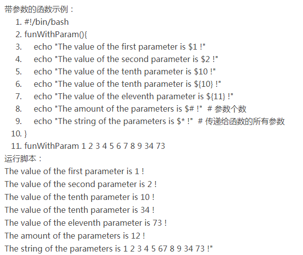

## Shell 输入输出重定向

### 输出重定向
<div class = "alert alert-block alert-success">
command > file
</div>

如果使用>>则追加到文件末尾：
<div class = "alert alert-block alert-success">
command >> file
</div>

### 输入重定向
注意：第一个会输出文件名users，第二个不会
<div class = "alert alert-block alert-success">
wc -l users
    
wc -l < users
</div>

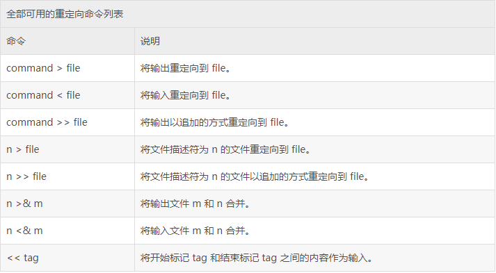

### Here Document
将两个delimiter之间的内容作为输入传递给command
```shell
command << delimiter
    
    document
    
delimiter
```

### /dev/null
不希望在屏幕上显示输出结果时，将输出重定向到/dev/null！
<div class = "alert alert-block alert-success">
command > /dev/null
</div>

## Shell文件包含
<div class = "alert alert-block alert-success">
. filename

source filename
</div>


## 相关网站

### Linux Shell脚本详细教程 ← 极其详细，极佳
https://blog.csdn.net/qq_16681169/article/details/78249584